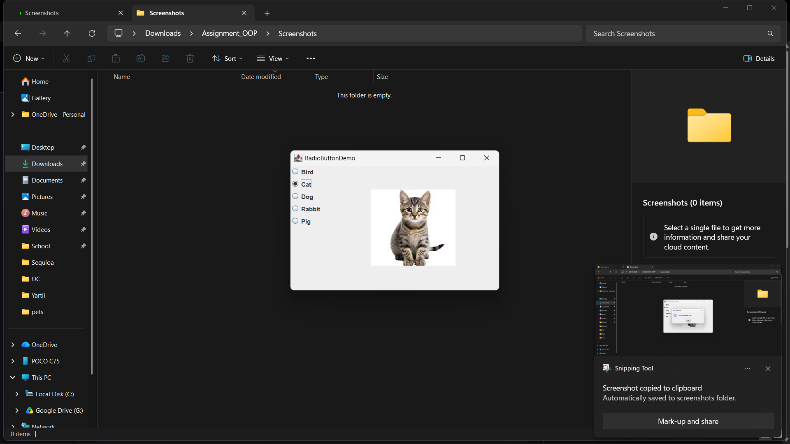
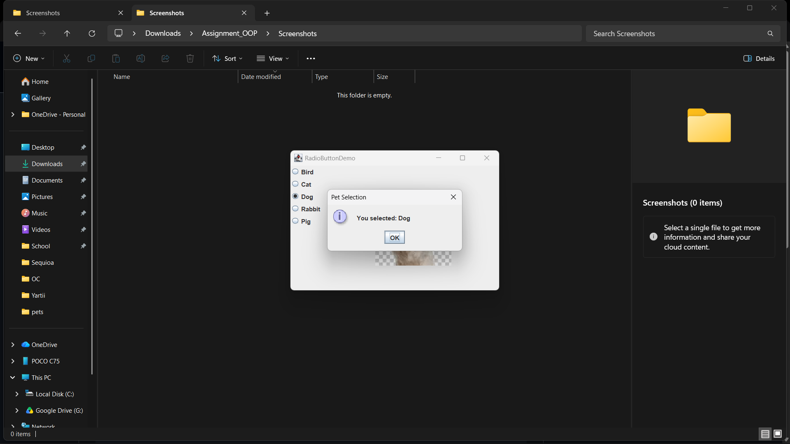
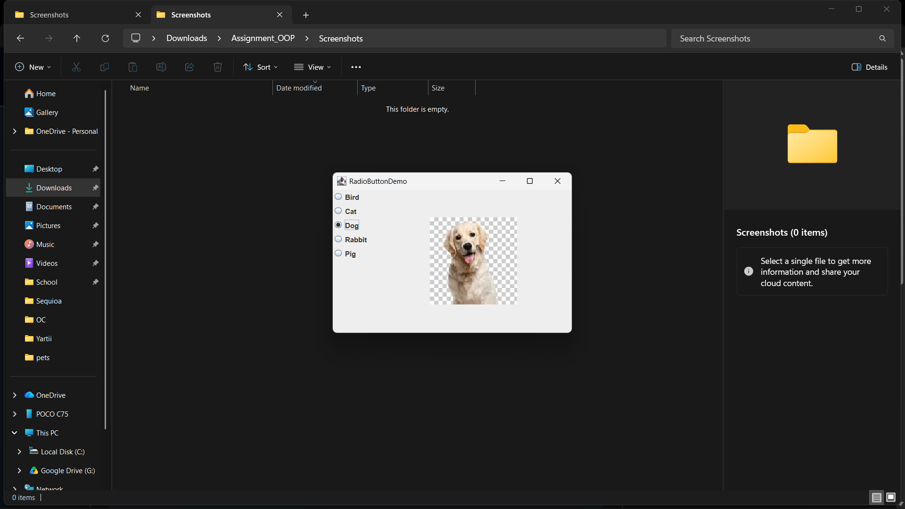
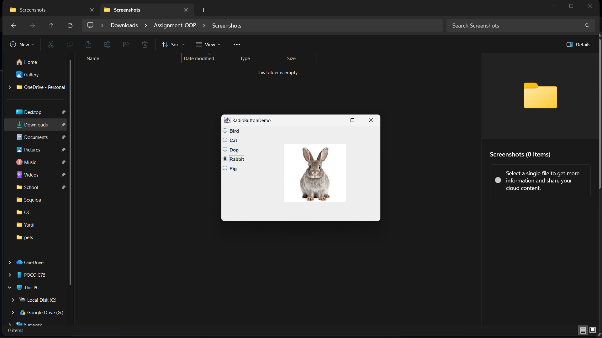
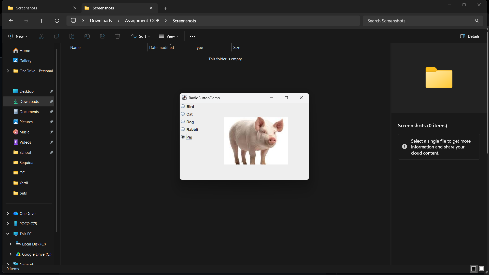

RadioButtonDemo

A very small Java Swing demo that uses five radio buttons to select a pet, displays the pet image, and shows a message box with the selection.

Prerequisites:
- Java JDK installed

How to compile:

```
javac src\RadioButtonDemo.java
```

How to run:

```
java -cp . src.RadioButtonDemo
```

Notes:
- Ensure the `pets/` folder (with bird.png, cat.png, dog.png, rabbit.png, pig.png) is in the project root so the images load correctly.
- The program uses relative paths for images (`pets/<name>.png`).

Screenshots

Below are the first 10 screenshots (place your images in the `Screenshots/` folder):














You can rename your actual screenshot files to match the names above or update these links accordingly.
